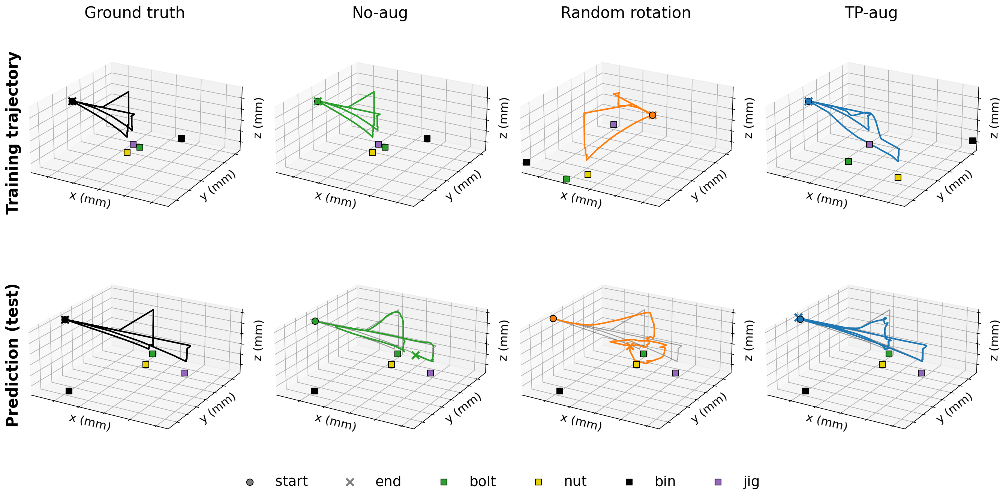
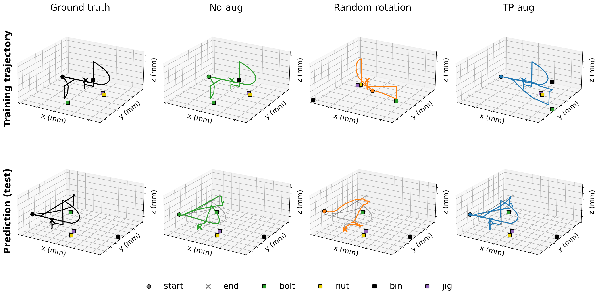
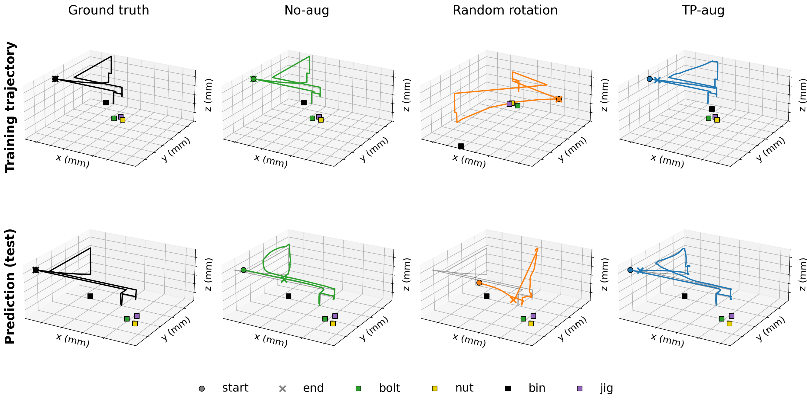
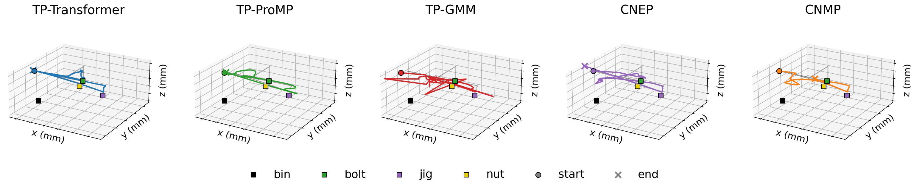
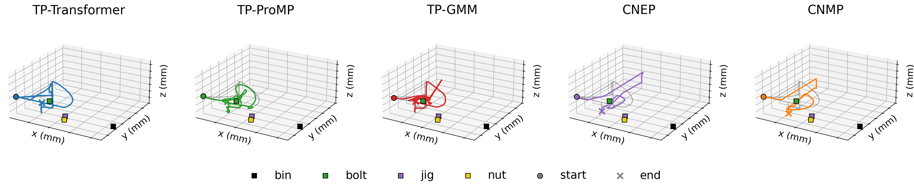
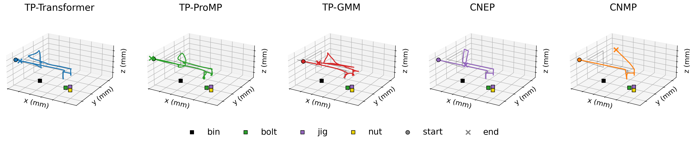

# TP-Transformer — Experimental Results

This document summarizes the experiments run for the TP-Transformer paper, using the canonical n-of-15 / 3-validation / 3-test split with five RNG seeds (9871, 9872, 9873, 9874, 9875).

Metrics:

- **ADE (mm)**: Average Displacement Error — per-step Euclidean distance between predicted and ground-truth XYZ, in physical millimetres (de-normalised using the seed's training-set mean and std).
- **NDQ**: Norm-of-Difference Quaternions — per-step ‖q_pred − q_gt‖ with the standard q ≡ −q antipode handling. Range [0, √2]; lower is better. NDQ ≈ 0.04 corresponds to roughly 5° angular error.

Reported numbers are **per-action mean ± std across the 5 seeds** (each seed's score is itself the mean across 3 test demos).

---

## 1. Training the TP-Transformer

The TP-Transformer is an encoder–decoder Transformer that conditions on the
scene's object poses (the task parameters) and the initial end-effector pose,
and autoregressively generates the remaining trajectory (position, orientation,
and grasp state) one camera-capture segment at a time.

**Architecture.** Embedding dimension 64, 8 attention heads, 3 encoder layers and
3 decoder layers, with a causal mask on the decoder. The encoder ingests the
object-pose sequence (per-object 7-D pose + one-hot object tag); the decoder
predicts the 8-D output (position, quaternion, grasp) plus an auxiliary action
class.

**Optimization.** Adam with initial LR = 1e-4, batch size 8, on PCS A100 (80 GB)
GPUs. A single model is trained per (action, seed); the three assembly actions
are learned independently. The training objective is a per-timestep-weighted sum
of four terms: position (weight 1), orientation/quaternion (weight 2), grasp
(weight 1000), and action classification (weight 100), summed over the trajectory.

**Learning-rate schedule and stopping.** We use `ReduceLROnPlateau` on a
validation metric (patience expressed in gradient steps, ≈3000, then scaled to
epochs by batches-per-epoch so the per-K optimization budget is comparable across
K). When the scheduler floors the learning rate at `min_lr = 1e-7`, further
updates are negligible and training stops. The best-on-validation checkpoint is
used for all predictions.

**Model selection and scheduling metric.** The *validation* metric that drives
(a) best-checkpoint selection, (b) the LR-scheduler step, and (c) the LR-floor
stop is a separate design choice from the training objective, and we evaluated
two options:

- **Total loss** — the full training objective (position + orientation + grasp +
  action), i.e. select and schedule on exactly what is optimized.
- **Waypoint error** — the error measured only at the precision-critical
  waypoints of the motion (the high-weight timesteps near grasp/release and slow
  segments), rather than averaged over the whole trajectory.

We found **waypoint-error selection consistently produces better accuracy than
total-loss selection at every K**, on both ADE and NDQ. Intuitively, the critical
waypoints are the hardest and last part of the motion to converge; selecting and
scheduling on them keeps the learning-rate schedule active until those segments
are actually learned, whereas the whole-trajectory total loss is dominated by the
many easy timesteps, plateaus early, and floors the LR before the hard regions
converge. All results in this document use waypoint-error selection; the full
comparison is in [Appendix A](#appendix-a-model-selection-metric-ablation).

---

## 2. Training the baselines

We compare against two classical task-parameterised movement-primitive methods
and two deep conditional-process methods.

### Classical baselines (TP-GMM, TP-ProMP)

These have closed-form / EM fits with no gradient-based training loop. We use the
standard task-parameterised formulations; the only fitted hyperparameter is the
number of GMM components (selected per fit). TP-GMM is ill-conditioned at K = 1–2
because EM cannot estimate stable per-component covariances from one or two
demonstrations (see the footnote under the Experiment 2 table).

### Deep baselines (CNEP, CNMP)

CNEP and CNMP are adapted from the official implementation accompanying
[Yildirim & Ugur, "Conditional Neural Expert Processes for Learning Movement
Primitives From Demonstration", IEEE RA-L 2024](https://ieeexplore.ieee.org/abstract/document/10711283)
([code](https://github.com/yildirimyigit/cnep), [preprint](https://arxiv.org/abs/2402.08424)).
The model architectures (encoder / gate / expert-decoder networks), the loss
(reconstruction NLL + batch-entropy + individual-entropy for CNEP; reconstruction
NLL for CNMP), and the core optimizer settings (Adam, LR = 3e-4, batch size 2,
2 experts, the entropy-loss coefficients, the `softplus(Σ)+1e-6` parametrization)
are taken **unchanged** from that repository. The paper itself does not report
these hyperparameters — they live only in the released code — so we inherit them
verbatim.

**What we changed to adapt CNEP/CNMP to the assembly task:**

- **Hidden dimensions.** The paper does not report layer sizes and the released
  code uses different widths across scripts (256–768) depending on the image
  feature extractor. We adopt the values from the MobileNet reference script
  (encoder [256, 256]; decoder [128, 128] for CNEP, [256, 256] for CNMP), the
  closest analog since we also use 1280-D MobileNetV2 image features.
- **Early stopping.** Upstream had none (it ran to a 5M-epoch budget). We stop
  when validation MSE has not reached a new minimum for 50,000 epochs (the
  5M budget is retained only as a ceiling).
- **Deterministic validation.** Upstream picked the "best" checkpoint off a
  single random subset of validation demos. We evaluate over all validation
  demos in fixed order (condition on t=0, predict t=1..T-1), making selection
  deterministic.
- **Conditioning regime.** We train each deep baseline two ways and report both:
  *multi-context* — the original paper's CNP-style training (random number of
  context/target points per step, `n_max = m_max = 20`); and *single-context* —
  an analog to how the TP-Transformer is conditioned (a single context point at
  t=0, predict the rest), giving the baseline the same ground-truth information
  budget the TP-Transformer has at inference. Validation and inference are
  identical across both regimes.
- **Correctness fixes (not tuning).** The upstream loss returns NaN when a
  training batch contains a fully-padded slot (`0/0` in the masked NLL), which
  happens whenever K < batch size — making K = 1 untrainable. We mask out
  fully-padded slots (mathematically identical to upstream when no slot is
  padded), clamp batch size ≤ K in the low-data regime, and move tensors to the
  GPU once before the loop (a speed fix). These are required to evaluate CNEP/CNMP
  at K = 1–2 at all.

A separate model is trained per (action, seed) for the deep baselines, and the
best-on-validation checkpoint is used for prediction.

---

## 3. Experiment 1 — Augmentation comparison (K = 15)

Compares three augmentation regimes for the TP-Transformer, holding everything
else (model, dataset, training schedule) fixed at K = 15 train demos per action:
**TP-aug** (task-parameterised augmentation), **random rotation** (a naive
geometric augmentation), and **none** (train on the raw demos with no
augmentation). The "none" arm is the control: it tells us whether an augmentation
helps over doing nothing.

Full per-action ADE/NDQ numbers are in [Appendix B](#appendix-b-detailed-result-tables).

### Findings

- **Only TP-aug improves over the no-augmentation baseline.** Ordering is TP-aug (17.7 mm) < none (26.9 mm) < random rotation (57.7 mm). TP-aug is **1.5× lower ADE** and **2.3× lower NDQ** than training with no augmentation.
- **Naive random rotation is *worse than doing nothing*** — 2.1× higher ADE and 3.1× higher NDQ than the no-augmentation baseline. Rotating trajectories without respecting the task geometry injects training signal inconsistent with the object-pose conditioning, actively harming the model.
- This makes the case for TP-aug stronger than a head-to-head against random rotation alone would: augmentation is **not** automatically beneficial; it helps only when it preserves the task-parameterised structure.
- Random rotation degrades **orientation** most (16× worse than TP-aug on action_2), confirming that the geometric structure TP-aug preserves is essential for tight rotational accuracy.
- All three arms are evaluated identically (same test demos, deterministic single forward pass per demo), so the differences reflect the training-time augmentation choice alone.

### Qualitative 3D trajectories

The figures below show, per action, the **training-time augmentation** (top row) and the resulting **model prediction vs. ground truth** (bottom row). Objects are drawn as squares (bolt green, nut yellow, box black, jig purple); the trajectory start is a circle and the end a cross.

Top row: the raw trajectory (Ground truth / No-aug are identical), the same trajectory under **random rotation**, and under **TP-aug**. Random rotation displaces the start/end points away from their task-defined locations (the original always starts/ends at the object-relative poses), whereas TP-aug preserves that structure. Bottom row: each model's prediction (coloured) overlaid on the test ground truth (faint black) — TP-aug tracks the GT closely; random rotation drifts.

(The random-rotation angle in the top row is fixed per action for a clear, reproducible illustration of the distribution shift; at training time the angle is sampled randomly.)

---

## 4. Experiment 2 — Methods × number of training demos

Compares TP-Transformer against the classical baselines (TP-ProMP, TP-GMM) and
the deep baselines (CNEP, CNMP) at K ∈ {1, 2, 5, 10, 15} demos per action. The
valid/test demo IDs are bit-identical across K and across methods
(reserve-eval-first sampler), so the comparison is apples-to-apples. K = 2 was
added because TP-GMM and TP-ProMP both rely on across-demo covariance, making
K = 1 degenerate for them; K = 2 is the cleanest minimum-data point at which all
methods are well-defined in principle. CNEP/CNMP use the original multi-context
CNP training regime (see §2).

Full per-K and per-action ADE/NDQ numbers are in [Appendix B](#appendix-b-detailed-result-tables).

### Findings

- **TP-Transformer is the best method at every (K, action, metric) cell.** At K = 1 it outperforms TP-ProMP by **3.6×** (ADE) and **5.0×** (NDQ); at K = 15 it remains **2.2×** lower ADE than TP-ProMP and **3.3×** lower than TP-GMM.
- **TP-Transformer needs few demos.** The K=1 → K=2 jump closes most of the gap (38.4 → 26.0 mm; −32%); past K=5 the curve flattens (K=5 = 21.6, K=10 = 18.1, K=15 = 17.8).
- **TP-GMM needs ≥ ~5 demos to be numerically stable.** At K = 1–2 it produces metre-scale predictions on action_0 due to EM collapse; K = 5 is where the mixture fit becomes well-conditioned across all actions.
- **Classical baselines saturate or regress past K=10.** TP-ProMP and TP-GMM both fail to improve monotonically from K=10 to K=15, suggesting the model classes lack the expressiveness to use the extra demos.
- **The deep CNP baselines (CNEP, CNMP) plateau high and barely scale with K** — ~120–130 mm at K=1, only ~87–94 mm at K=15, never approaching even TP-ProMP. They are architecturally limited for this task, not data-starved, and are worse than TP-ProMP at every K ≥ 2. (We report the original multi-context training regime; a single-context variant matched to the TP-Transformer conditioning performs comparably.)
- **Low-data robustness is TP-Transformer's strongest comparative advantage** — the gap to baselines is largest at K=1–2 and shrinks (in relative terms) as K grows.

### Qualitative 3D trajectories (K = 15)

Per action, each panel shows a method's K = 15 prediction (coloured) overlaid on the test ground truth (faint black). Objects are squares (bolt green, nut yellow, box black, jig purple); the prediction start is a circle and the end a cross. TP-Transformer tracks the ground truth closely, while TP-ProMP, CNEP, and CNMP drift; TP-GMM is reasonable at K = 15 (it is the degenerate metre-scale case only at K = 1–2). CNEP/CNMP use the multi-context regime.

---

## Summary

| Question                                            | Result |
|-----------------------------------------------------|--------|
| Does TP-augmentation help over plain random rotation? | **Yes** — 3.3× lower ADE, 7.4× lower NDQ at K=15. Random rotation is *worse than no augmentation* (57.7 vs 26.9 mm); only TP-aug beats the no-aug baseline (17.7 vs 26.9 mm). |
| How does TP-Transformer compare to classical baselines? | **Best at every K and every action**, largest margin at K=1. |
| How does it compare to deep CNP baselines (CNEP, CNMP)? | **Best by 3–5×.** CNEP/CNMP plateau at ~87–130 mm and never beat even TP-ProMP. |
| Is the TP-Transformer worth the added complexity? | **Yes for low-data (K ≤ 5).** Classical baselines never close the gap, even at K=15. |
| How much data is "enough" for TP-Transformer? | **K=5** captures most of the benefit (ADE −44% from K=1 to K=5; only −18% more from K=5 to K=15). |

---

## Appendix A — Model-selection metric ablation

All TP-Transformer runs minimize the same training objective; only the validation
metric driving best-checkpoint selection, the LR-scheduler step, and the LR-floor
stop differs. We compared **waypoint-error** selection (used for all reported
numbers) against **total-loss** selection (select/schedule on the full training
objective), holding everything else fixed (5 seeds each).

Mean ADE (mm) / NDQ across actions, TP-Transformer:

| K  | ADE: waypoint error | ADE: total loss | NDQ: waypoint error | NDQ: total loss |
|----|---------------------|-----------------|---------------------|-----------------|
| 1  | **38.4**            | 48.0            | **0.068**           | 0.100           |
| 2  | **26.0**            | 34.8            | **0.040**           | 0.059           |
| 5  | **21.6**            | 25.9            | **0.036**           | 0.052           |
| 10 | **18.1**            | 24.7            | **0.028**           | 0.048           |
| 15 | **17.8**            | 18.9            | **0.026**           | 0.039           |

Waypoint-error selection is better at every K, on both ADE and NDQ. The waypoint
error tracks the hardest, last-to-converge part of the motion (the precision
waypoints near grasp/release and slow segments), so it keeps the LR schedule
active until those segments converge; the whole-trajectory total loss is dominated
by the many easy timesteps, plateaus earlier, and floors the LR before the hard
regions are fully learned.

---

## Appendix B — Detailed result tables

### Experiment 1 — Augmentation, position error (ADE, mm)

| Action   | TP-aug         | None            | Random rotation |
|----------|----------------|-----------------|-----------------|
| action_0 | **19.0 ± 5.0** | 30.7 ± 4.5      | 54.4 ± 11.3     |
| action_1 | **17.9 ± 2.8** | 29.7 ± 2.4      | 63.8 ± 13.5     |
| action_2 | **16.3 ± 2.7** | 20.3 ± 2.0      | 54.8 ± 8.5      |
| **mean** | **17.7**       | 26.9            | 57.7            |

### Experiment 1 — Augmentation, orientation error (NDQ)

| Action   | TP-aug              | None                | Random rotation     |
|----------|---------------------|---------------------|---------------------|
| action_0 | **0.026 ± 0.004**   | 0.050 ± 0.007       | 0.107 ± 0.027       |
| action_1 | **0.035 ± 0.018**   | 0.094 ± 0.024       | 0.218 ± 0.036       |
| action_2 | **0.016 ± 0.004**   | 0.038 ± 0.009       | 0.250 ± 0.106       |
| **mean** | **0.026**           | 0.061               | 0.192               |

### Experiment 2 — Methods × K, position error (ADE, mm), averaged across actions

| K  | TP-Transformer | TP-ProMP | TP-GMM | CNEP  | CNMP  |
|----|----------------|----------|--------|-------|-------|
| 1  | **38.4**       | 139.6    | 3377†  | 129.3 | 123.6 |
| 2  | **26.0**       | 70.4     | 1702†  | 124.0 | 116.9 |
| 5  | **21.6**       | 45.9     | 98.1   | 119.1 | 113.3 |
| 10 | **18.1**       | 37.5     | 63.6   | 102.0 | 100.4 |
| 15 | **17.8**       | 39.3     | 58.6   | 93.7  | 86.8  |

† TP-GMM at K = 1 fits a Gaussian mixture (2–50 components) to a single training trajectory per action; the EM fit collapses (zero-variance components, large extrapolation at test time) and produces metre-scale predictions on action_0 in particular. This is a known failure mode of mixture-density methods at K = 1, not a numerical bug. At K = 2 the EM still struggles on action_0 while action_1/action_2 improve.

### Experiment 2 — Methods × K, orientation error (NDQ), averaged across actions

| K  | TP-Transformer | TP-ProMP | TP-GMM | CNEP  | CNMP  |
|----|----------------|----------|--------|-------|-------|
| 1  | **0.068**      | 0.338    | 0.676  | 0.130 | 0.121 |
| 2  | **0.040**      | 0.078    | 0.444  | 0.121 | 0.118 |
| 5  | **0.036**      | 0.095    | 0.096  | 0.113 | 0.112 |
| 10 | **0.028**      | 0.038    | 0.087  | 0.111 | 0.108 |
| 15 | **0.026**      | 0.041    | 0.083  | 0.108 | 0.102 |

### Experiment 2 — Per-action ADE detail (mm)

| Method          | Action   | K=1               | K=2              | K=5              | K=10             | K=15             |
|-----------------|----------|-------------------|------------------|------------------|------------------|------------------|
| TP-Transformer  | action_0 | 39.4 ± 16.6       | 29.7 ± 10.2      | 21.8 ± 4.1       | 21.4 ± 2.5       | 19.0 ± 5.0       |
| TP-Transformer  | action_1 | 48.1 ± 15.5       | 25.3 ± 3.7       | 22.7 ± 4.4       | 17.3 ± 2.8       | 17.9 ± 2.8       |
| TP-Transformer  | action_2 | 27.6 ± 2.3        | 23.0 ± 2.5       | 20.2 ± 7.3       | 15.6 ± 1.6       | 16.3 ± 2.7       |
| TP-ProMP        | action_0 | 149.0 ± 33.4      | 101.5 ± 39.2     | 69.1 ± 23.6      | 45.9 ± 7.8       | 53.4 ± 7.2       |
| TP-ProMP        | action_1 | 182.5 ± 45.8      | 82.5 ± 22.3      | 48.7 ± 4.8       | 47.3 ± 4.8       | 46.4 ± 3.8       |
| TP-ProMP        | action_2 | 87.2 ± 8.0        | 27.3 ± 10.5      | 20.0 ± 1.6       | 19.3 ± 1.2       | 18.2 ± 1.4       |
| TP-GMM          | action_0 | 8024 ± 4866       | 4748 ± 4091      | 158.0 ± 20.7     | 88.1 ± 21.8      | 75.8 ± 9.0       |
| TP-GMM          | action_1 | 1957 ± 505        | 253.8 ± 31.4     | 92.2 ± 33.0      | 64.3 ± 9.9       | 66.4 ± 13.2      |
| TP-GMM          | action_2 | 149.7 ± 101.8     | 104.6 ± 20.8     | 44.2 ± 7.3       | 38.4 ± 3.4       | 33.6 ± 1.6       |

---

## Reproducing

The data, splits manifests, and trained checkpoints needed to regenerate every number in this document are at:

- Repo: `https://github.com/x35yao/TP-Transformer-assembly` (private)
- Splits: `data/splits/n{1,2,5,10,15}_v3t3.yaml` (5 seeds each, reserve-eval-first sampler)
- Pickles: `baselines/data/baseline_dataset_n{1,2,5,10,15}_v3t3.pickle`
- Trained checkpoints and result CSVs: `/shared/$USER/RingAIAutoAnnotation/eval/...`

Note on directory naming: the on-disk `eval/exp1/` and `eval/exp2/` folders predate
the experiment renumbering in this document — `eval/exp2/` holds the augmentation
(Experiment 1) runs and `eval/exp1/` holds the K-sweep (Experiment 2) runs.
