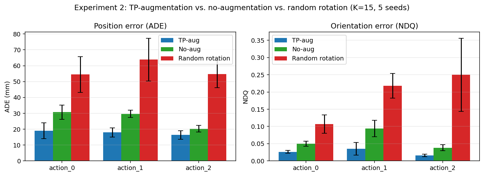
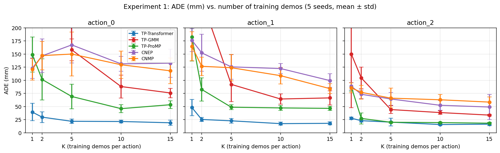
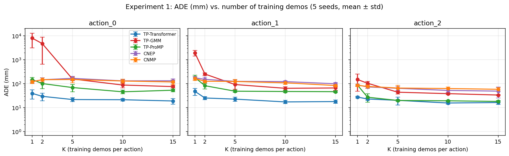
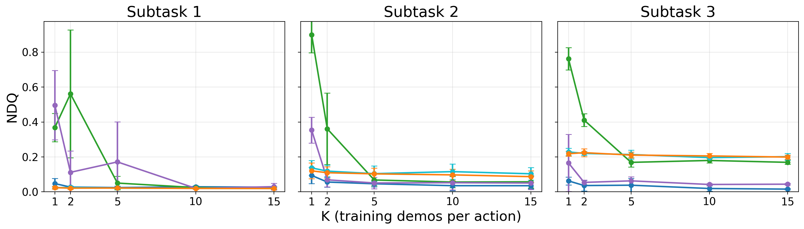

# TP-Transformer — Experimental Results

This document summarizes the two main experiments run for the TP-Transformer paper, using the canonical n-of-15 / 3-validation / 3-test split with five RNG seeds (9871, 9872, 9873, 9874, 9875).

All experiments were run on PCS A100 (80 GB) GPUs. The TP-Transformer was trained with Adam at LR = 1e-4, batch size 8, with `ReduceLROnPlateau(patience=500 epochs at K=15, scaled to ~3000 gradient steps for fair comparison across K)` and stopped when the LR floor `min_lr=1e-7` was reached. Best-on-validation checkpoints were used for prediction. The CNEP/CNMP deep baselines inherit their architecture, loss, and optimizer settings from the original CNEP repository; see [Baseline training details](#baseline-training-details) for the full inherited-vs-chosen hyperparameter breakdown.

Metrics:

- **ADE (mm)**: Average Displacement Error — per-step Euclidean distance between predicted and ground-truth XYZ, in physical millimetres (de-normalised using the seed's training-set mean and std).
- **NDQ**: Norm-of-Difference Quaternions — per-step ‖q_pred − q_gt‖ with the standard q ≡ −q antipode handling. Range [0, √2]; lower is better. NDQ ≈ 0.04 corresponds to roughly 5° angular error.

Reported numbers are **per-action mean ± std across the 5 seeds** (each seed's score is itself the mean across 3 test demos).

---

## Experiment 2 — Augmentation comparison (TP-aug vs random rotation vs none, K=15)

Compares three augmentation regimes for the TP-Transformer, holding everything else (model, dataset, training schedule) fixed at K=15 train demos per action: **TP-aug** (task-parameterised augmentation), **random rotation** (a naive geometric augmentation), and **none** (train on the raw K demos with no augmentation). The "none" arm is the natural control: it tells us whether an augmentation actually helps over doing nothing.

### Position error (ADE, mm)

| Action   | TP-aug         | None            | Random rotation |
|----------|----------------|-----------------|-----------------|
| action_0 | **19.0 ± 5.0** | 30.7 ± 4.5      | 54.4 ± 11.3     |
| action_1 | **17.9 ± 2.8** | 29.7 ± 2.4      | 63.8 ± 13.5     |
| action_2 | **16.3 ± 2.7** | 20.3 ± 2.0      | 54.8 ± 8.5      |
| **mean** | **17.7**       | 26.9            | 57.7            |

### Orientation error (NDQ)

| Action   | TP-aug              | None                | Random rotation     |
|----------|---------------------|---------------------|---------------------|
| action_0 | **0.026 ± 0.004**   | 0.050 ± 0.007       | 0.107 ± 0.027       |
| action_1 | **0.035 ± 0.018**   | 0.094 ± 0.024       | 0.218 ± 0.036       |
| action_2 | **0.016 ± 0.004**   | 0.038 ± 0.009       | 0.250 ± 0.106       |
| **mean** | **0.026**           | 0.061               | 0.192               |

### Findings

- **Only TP-aug improves over the no-augmentation baseline.** Ordering is TP-aug (17.7 mm) < none (26.9 mm) < random rotation (57.7 mm). TP-aug is **1.5× lower ADE** and **2.3× lower NDQ** than training with no augmentation.
- **Naive random rotation is *worse than doing nothing*** — 2.1× higher ADE and 3.1× higher NDQ than the no-augmentation baseline. Rotating trajectories without respecting the task geometry injects training signal that is inconsistent with the object-pose conditioning, actively harming the model.
- This makes the case for TP-aug much stronger than a head-to-head against random rotation alone would: augmentation is **not** automatically beneficial; it helps only when it preserves the task-parameterised structure.
- Random rotation degrades **orientation** most (16× worse than TP-aug on action_2), confirming that the geometric structure TP-aug preserves is essential for tight rotational accuracy.
- All three arms are evaluated identically (same test demos, same deterministic single forward pass per demo; no test-time augmentation or averaging), so the differences reflect the training-time augmentation choice alone.



---

## Experiment 1 — Methods × number of training demos

Compares TP-Transformer against two classical task-parameterised baselines (TP-ProMP and TP-GMM) at K ∈ {1, 2, 5, 10, 15} demos per action. The valid/test demo IDs are bit-identical across K and across methods (reserve-eval-first sampler), so the comparison is apples-to-apples. K=2 was added because TP-GMM and TP-ProMP both rely on across-demo covariance, making K=1 degenerate for them; K=2 is the cleanest minimum-data point at which all three methods are well-defined in principle.

### Position error (ADE, mm) — averaged across actions

CNEP/CNMP are shown for both training regimes: **sc** = single-context, **mc** = multi-context (see [Baseline training details](#deep-baselines-cnep-cnmp)).

| K  | TP-Transformer | TP-ProMP | TP-GMM | CNEP-sc | CNEP-mc | CNMP-sc | CNMP-mc |
|----|----------------|----------|--------|---------|---------|---------|---------|
| 1  | **38.4**       | 139.6    | 3377†  | 128.5   | 129.3   | 124.5   | 123.6   |
| 2  | **26.0**       | 70.4     | 1702†  | 125.1   | 124.0   | 110.5   | 116.9   |
| 5  | **21.6**       | 45.9     | 98.1   | 120.4   | 119.1   | 107.3   | 113.3   |
| 10 | **18.1**       | 37.5     | 63.6   | 111.2   | 102.0   | 104.2   | 100.4   |
| 15 | **17.8**       | 39.3     | 58.6   | 96.7    | 93.7    | 93.0    | 86.8    |

† TP-GMM at K=1 fits a Gaussian-mixture with 2–50 components to a single training trajectory per action; the EM fit collapses (zero-variance components, large extrapolation at test time) and produces predictions on the order of metres on action_0 in particular. This is a known failure mode of mixture-density methods at K=1, not a numerical bug. We report the number for completeness. At K=2 the EM still struggles on action_0 (mean ADE ≈ 4.7 m across seeds) while action_1/action_2 improve roughly 8× and 1.4× respectively over K=1.

### Orientation error (NDQ) — averaged across actions

| K  | TP-Transformer | TP-ProMP | TP-GMM | CNEP-sc | CNEP-mc | CNMP-sc | CNMP-mc |
|----|----------------|----------|--------|---------|---------|---------|---------|
| 1  | **0.068**      | 0.338    | 0.676  | 0.139   | 0.130   | 0.120   | 0.121   |
| 2  | **0.040**      | 0.078    | 0.444  | 0.138   | 0.121   | 0.113   | 0.118   |
| 5  | **0.036**      | 0.095    | 0.096  | 0.112   | 0.113   | 0.108   | 0.112   |
| 10 | **0.028**      | 0.038    | 0.087  | 0.106   | 0.111   | 0.105   | 0.108   |
| 15 | **0.026**      | 0.041    | 0.083  | 0.108   | 0.108   | 0.105   | 0.102   |

### Per-action ADE detail

| Method          | Action   | K=1               | K=2              | K=5              | K=10             | K=15             |
|-----------------|----------|-------------------|------------------|------------------|------------------|------------------|
| TP-Transformer  | action_0 | 39.4 ± 16.6       | 29.7 ± 10.2      | 21.8 ± 4.1       | 21.4 ± 2.5       | 19.0 ± 5.0       |
| TP-Transformer  | action_1 | 48.1 ± 15.5       | 25.3 ± 3.7       | 22.7 ± 4.4       | 17.3 ± 2.8       | 17.9 ± 2.8       |
| TP-Transformer  | action_2 | 27.6 ± 2.3        | 23.0 ± 2.5       | 20.2 ± 7.3       | 15.6 ± 1.6       | 16.3 ± 2.7       |
| TP-ProMP        | action_0 | 149.0 ± 33.4      | 101.5 ± 39.2     | 69.1 ± 23.6      | 45.9 ± 7.8       | 53.4 ± 7.2       |
| TP-ProMP        | action_1 | 182.5 ± 45.8      | 82.5 ± 22.3      | 48.7 ± 4.8       | 47.3 ± 4.8       | 46.4 ± 3.8       |
| TP-ProMP        | action_2 | 87.2 ± 8.0        | 27.3 ± 10.5      | 20.0 ± 1.6       | 19.3 ± 1.2       | 18.2 ± 1.4       |
| TP-GMM          | action_0 | 8024 ± 4866       | 4748 ± 4091      | 158.0 ± 20.7     | 88.1 ± 21.8      | 75.8 ± 9.0       |
| TP-GMM          | action_1 | 1957 ± 505        | 253.8 ± 31.4     | 92.2 ± 33.0      | 64.3 ± 9.9       | 66.4 ± 13.2      |
| TP-GMM          | action_2 | 149.7 ± 101.8     | 104.6 ± 20.8     | 44.2 ± 7.3       | 38.4 ± 3.4       | 33.6 ± 1.6       |

### Findings

- **TP-Transformer is the best method at every (K, action, metric) cell.**
  - At K=1 it outperforms TP-ProMP by **3.6×** (ADE) and **5.0×** (NDQ); the TP-GMM gap is much larger.
  - At K=2 it remains **2.7×** lower ADE than TP-ProMP and ~65× lower than TP-GMM (TP-GMM still has a degenerate action_0 fit even with two demos).
  - At K=15 it remains **2.2×** lower ADE than TP-ProMP and **3.3×** lower than TP-GMM.

- **TP-Transformer requires few demos to be effective.** The K=1 → K=2 jump alone closes most of the gap (38.4 → 26.0 mm; −32%); past K=5 the curve flattens (K=5 = 21.6, K=10 = 18.1, K=15 = 17.8).

- **TP-GMM needs at least ~5 demos to be numerically stable.** At K=1 and K=2 it produces metre-scale predictions on action_0 due to EM collapse; K=5 is the point at which the mixture fit becomes well-conditioned across all actions.

- **Classical baselines saturate or even regress past K=10.** TP-ProMP and TP-GMM both fail to monotonically improve from K=10 to K=15. Suggests the model classes lack expressiveness to use the additional demos; TP-Transformer keeps a small but consistent edge.

- **The deep CNP-family baselines (CNEP, CNMP) plateau high and barely scale with K.** Across both training regimes they sit at ~120–130 mm mean ADE at K=1 and only reach ~87–97 mm at K=15 — never approaching even TP-ProMP (39 mm at K=15), let alone TP-Transformer (18 mm). They are not data-starved; they are architecturally limited for this task. Notably they are **worse than the classical TP-ProMP at every K ≥ 2**, indicating that a generic image-conditioned CNP does not exploit the task structure as effectively as the task-parameterised methods.

- **single-context vs multi-context training is roughly a wash for CNEP/CNMP**, with multi-context marginally better at high K (e.g. CNMP K=15: 86.8 mc vs 93.0 sc mm). The implicit data augmentation from random observation sampling helps slightly once there are enough demos, but does not change the qualitative picture.

- **Low-data robustness is TP-Transformer's strongest comparative advantage.** The gap to baselines is **largest at K=1–2** and *decreases* (in relative terms) as K grows. For applications where collecting demos is expensive, TP-Transformer dominates.



(The linear plot caps at 200 mm so TP-GMM K=1 doesn't compress the rest of the panel; see log-scale variant below.)





---

## Baseline training details

### Classical baselines (TP-GMM, TP-ProMP)

These have closed-form / EM fits with no gradient-based training loop. We use the
standard task-parameterised formulations; the only fitted hyperparameter is the
number of GMM components (selected per fit). TP-GMM is ill-conditioned at K=1–2
(see the footnote under the ADE table) because EM cannot estimate stable
per-component covariances from one or two demonstrations.

### Deep baselines (CNEP, CNMP)

CNEP and CNMP are adapted from the official implementation accompanying
[Yildirim & Ugur, "Conditional Neural Expert Processes for Learning Movement
Primitives From Demonstration", IEEE RA-L 2024](https://ieeexplore.ieee.org/abstract/document/10711283)
([code](https://github.com/yildirimyigit/cnep), [preprint](https://arxiv.org/abs/2402.08424)).
The model architectures (encoder / gate / expert-decoder networks), the loss
(reconstruction NLL + batch-entropy + individual-entropy for CNEP; reconstruction
NLL for CNMP), and the core optimizer settings are taken unchanged from that
repository. We list below which settings were inherited and which we set for the
assembly task, to make the comparison reproducible and to be explicit about
deviations.

**Inherited from the upstream repository (unchanged):**

| Hyperparameter | Value | Source |
|----------------|-------|--------|
| Optimizer | Adam | upstream default |
| Learning rate | 3e-4 | upstream default |
| Batch size | 2 | upstream default |
| CNEP experts (decoders) | 2 | upstream default |
| Loss coefficients (CNEP) | `nll=16.81`, `batch_entropy=10.672`, `ind_entropy=7.553`, `scale_coefs=True` | upstream (W&B grid-search values; not reported in the paper, only in code) |
| Std parametrization | `softplus(Σ) + 1e-6` | upstream default |
| Validation cadence | every 1000 epochs | upstream default |
| Best-on-validation checkpoint | yes | upstream behaviour |

The paper itself does not specify learning rate, optimizer, batch size, epoch
budget, or the entropy-loss coefficients (it states only that the coefficients
were "found empirically by grid search using Weights & Biases"); these live solely
in the released code, and we inherit them verbatim.

**Set by us for the assembly task:**

| Hyperparameter | Value | Rationale |
|----------------|-------|-----------|
| Encoder hidden dims | [256, 256] | matches the upstream MobileNet reference script (`train_cnep_with_mobilenet_v2.py`), the closest analog since we also use 1280-D MobileNetV2 image features |
| Decoder hidden dims | CNEP [128, 128] / CNMP [256, 256] | matches the same reference script (CNEP and CNMP use different decoder widths upstream) |
| Epoch budget | 5,000,000 (matches upstream default) | effectively a ceiling; runs end via early stopping well before this |
| Early stopping | patience = 50,000 epochs on validation MSE | upstream had **no** early stopping (ran to the full budget); we stop when val MSE has not reached a new minimum for 50k epochs. Improvement is threshold-free (any strict decrease resets patience), consistent with the best-checkpoint rule. |
| Validation metric | full-trajectory MSE: condition on t=0, predict t=1..T-1 over all validation demos in fixed order | deterministic; replaces upstream's noisy random-subset validation, which picked "best" off a single random snapshot |
| Conditioning regime | two variants compared (see below) | — |

Note on hidden dimensions: there is no single "original" width to inherit — the
paper states layer sizes are set empirically and does not report them, and the
released code uses different widths across scripts (256–768) depending on the
image feature extractor. We adopt the values from the MobileNet reference script
(the closest analog to our setup), since both use 1280-D MobileNetV2 features.
Hidden width is exposed as a CLI flag (`--encoder-dims` / `--decoder-dims`) so a
capacity ablation can be run later; an earlier 512-wide run is archived for that
comparison.

**Two training regimes compared (`single-context` vs `multi-context`).** The CNP
family is trained by conditioning on a set of observation (context) points and
predicting at target timepoints. Both TP-Transformer and these deep baselines
ultimately condition on the **scene** (object poses for TP-Transformer; MobileNetV2
image features for CNEP/CNMP — two encodings of the same scene information) plus
the **initial pose**, and generate the rest of the trajectory. We train CNEP/CNMP
two ways:

- **multi-context** — the **original paper's** CNP-style training: each step samples
  a random number of context points `n ∈ [1, n_max)` and target points
  `m ∈ [1, m_max)` (`n_max = m_max = 20`) at random timesteps. This is the faithful
  reproduction of the published method and provides implicit data augmentation.
- **single-context** — an analog to **how TP-Transformer is trained/deployed**:
  condition on a single context point at `t=0` and predict the entire remaining
  trajectory (`t=1..T-1`). This gives the baseline the same ground-truth
  information budget TP-Transformer has at inference (scene + start pose, then
  generate the rest), rather than the extra random intermediate observations the
  multi-context regime sees during training.

Validation and inference are **identical** across both regimes (condition on `t=0`,
predict `t=1..T-1`, over all val/test demos), so the two are evaluated on exactly
the same task and differ only in their training-time conditioning. In both regimes
a separate model is trained per `(action, seed)` and the best-on-validation
checkpoint is used for prediction.

**Bug fixes applied to the upstream code (correctness, not tuning).** The upstream
loss returns NaN whenever a training batch contains a fully-padded slot
(`0/0` in the masked NLL), which occurs whenever `K < batch_size` — i.e. at K=1
and, with the default batch size, made low-data training impossible. We mask out
fully-padded slots before averaging; when no slots are padded the computation is
mathematically identical to upstream. We also clamp `batch_size ≤ K` in the
low-data regime and move tensors to the GPU once before the loop (a performance
fix). These changes are required to evaluate CNEP/CNMP at K=1–2 at all and do not
alter the loss formulation.

---

## Summary

| Question                                            | Result |
|-----------------------------------------------------|--------|
| Does TP-augmentation help over plain random rotation? | **Yes** — 3.3× lower ADE, 7.4× lower NDQ at K=15. And random rotation is *worse than no augmentation* (57.7 vs 26.9 mm), so only TP-aug beats the no-aug baseline (17.7 vs 26.9 mm). |
| How does TP-Transformer compare to classical baselines? | **Best at every K and every action**, with the largest margin at K=1. |
| How does it compare to deep CNP baselines (CNEP, CNMP)? | **Best by 3–5×.** CNEP/CNMP plateau at ~87–130 mm and never beat even TP-ProMP; training regime (single- vs multi-context) barely matters. |
| Is the TP-Transformer worth the added complexity? | **Yes for low-data (K ≤ 5).** Classical baselines never close the gap, even at K=15. |
| How much data is "enough" for TP-Transformer? | **K=5** captures most of the benefit; ADE drops 32% from K=1→K=2 and 44% from K=1→K=5; only 18% more from K=5 to K=15. |

## Reproducing

The data, splits manifests, and trained checkpoints needed to regenerate every number in this document are at:

- Repo: `https://github.com/x35yao/TP-Transformer-assembly` (private)
- Splits: `data/splits/n{1,2,5,10,15}_v3t3.yaml` (5 seeds each, reserve-eval-first sampler)
- Pickles: `baselines/data/baseline_dataset_n{1,2,5,10,15}_v3t3.pickle`
- Trained checkpoints: `/shared/$USER/RingAIAutoAnnotation/eval/{exp1,exp2}/...`
- Result CSVs: `/shared/$USER/RingAIAutoAnnotation/eval/results/{exp1,exp2}/...`

To reproduce evaluation from the trained checkpoints:

```bash
sbatch scripts/slurm/predict_exp2.sbatch     # TP-Transformer test-set inference (10 cells, exp2)
sbatch scripts/slurm/predict_exp1.sbatch     # TP-Transformer test-set inference (25 cells, exp1)
sbatch scripts/slurm/evaluate_exp2.sbatch    # CSV summary for exp2
sbatch scripts/slurm/evaluate_exp1.sbatch    # CSV summary for exp1 (one per K)
```

To train the CNEP/CNMP deep baselines (one model per action × seed; 5 K × 5 seeds
= 25 array tasks per job; each job is one method × sampling regime):

```bash
sbatch scripts/slurm/exp1_cnep_fixed.sbatch    # CNEP, single-context (condition on t=0 -> predict t=1..T-1)
sbatch scripts/slurm/exp1_cnep_random.sbatch   # CNEP, multi-context (upstream CNP-style random sampling)
sbatch scripts/slurm/exp1_cnmp_fixed.sbatch    # CNMP, single-context
sbatch scripts/slurm/exp1_cnmp_random.sbatch   # CNMP, multi-context
```
